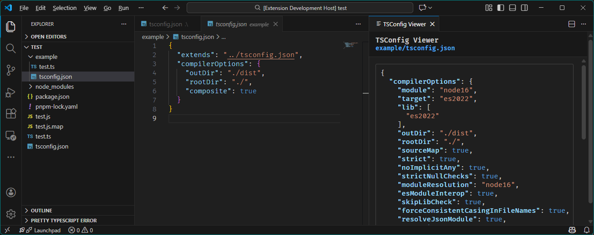

# TSConfig Viewer

A VSCode extension that displays the complete TypeScript configuration for `tsconfig` files in monorepo setups.

## Features

- **View Complete Config**: Shows the fully resolved TypeScript configuration
- **Monorepo Support**: Works with any tsconfig.json or tsconfig.\*.json file in your workspace
- **Auto-Refresh**: Automatically updates the viewer when you save changes to the tsconfig file
- **Local TypeScript Support**: Uses your project's local TypeScript installation if available, falls back to global

## Usage

1. Open any `tsconfig.json` or `tsconfig.*.json` file in your editor
2. Click the "Show Complete TSConfig" button in the editor title bar, or
3. Run the command **TSConfig Viewer: Show Complete TSConfig** from the Command Palette (Ctrl+Shift+P / Cmd+Shift+P)
4. The complete configuration will be displayed in a side panel

Saving your tsconfig file will automatically update the side panel

## Requirements

- Visual Studio Code 1.85.0 or higher
- TypeScript installed (locally in your project or globally)

## How It Works

The extension executes `tsc --project <path> --showConfig` to get the resolved configuration including all inherited settings from extended configs. This is especially useful in monorepo setups where configs extend from base configurations.

## Development

To run the extension in development mode:

1. Install dependencies: `pnpm install`
2. Compile: `npm run compile` or `npm run watch`
3. Press F5 to open a new VSCode window with the extension loaded
4. Open a tsconfig file and test the extension

## License

ISC (https://opensource.org/license/isc-license-txt)
